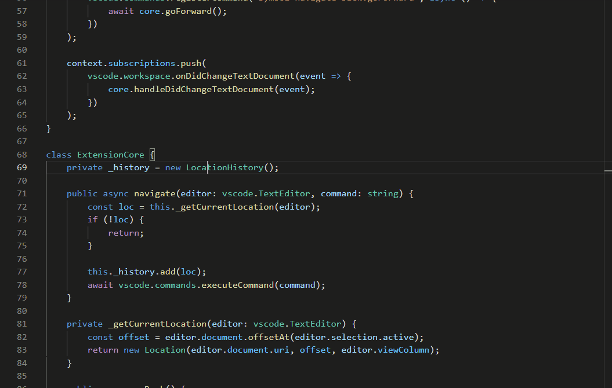

# Symbol Navigate Back

### Jump back from "Go to Definition" (F12)

This extension provides alternative commands for symbol navigation commands such as `Go to Definition (F12)`, `Go to Implementation (Ctrl+F12)` , and `Go to References (Shift+F12)`.

The alternative commands save the current cursor position (add it to the internal stack) and then call the original command to jump. You can return directly to the original position regardless of cursor movement or editing at the jump destination.

### About built-in "Go Back"
You can also use VSCode built-in `Go Back` command (default keymap: `Alt+Left` / `Ctrl+-`) to return to the original position. However, depending on cursor move operations at the jump destination (Searching, scrolling by `PageUp` / `PageDown`, etc), the cursor position will be added to the history, so you may need to `Go Back` many times.

## How to Use
Copy and paste the following settings into your `keybindings.json`. These settings override default keymaps, and add keymaps for commands which have no default keymaps. Change the key assignments as needed.

This allows you to go back directly to the original position with `Alt+[` (macOS: `Option+[`) after jumping with symbol navigation commands (`Go to Definition (F12)`, `Go to Implementation (Ctrl+F12)`, etc).
``` json
{
	"key": "f12",
	"command": "symbolNavigateBack.revealDefinition",
	"when": "editorHasDefinitionProvider && editorTextFocus && !isInEmbeddedEditor"
},
{
	"key": "ctrl+alt+f12",
	"command": "symbolNavigateBack.revealDeclaration",
	"when": "editorHasDeclarationProvider && editorTextFocus && !isInEmbeddedEditor"
},
{
	"key": "ctrl+shift+alt+f12",
	"command": "symbolNavigateBack.goToTypeDefinition",
	"when": "editorHasImplementationProvider && editorTextFocus && !isInEmbeddedEditor"
},
{
	"key": "ctrl+f12",
	"command": "symbolNavigateBack.goToImplementation",
	"when": "editorHasImplementationProvider && editorTextFocus && !isInEmbeddedEditor"
},
{
	"key": "shift+f12",
	"command": "symbolNavigateBack.goToReferences",
	"when": "editorHasReferenceProvider && editorTextFocus && !inReferenceSearchEditor && !isInEmbeddedEditor"
},
{
	"key": "ctrl+t",
	"command": "symbolNavigateBack.executeCommand",
	"args": "workbench.action.showAllSymbols"
}
{
	"key": "alt+[",
	"command": "symbolNavigateBack.navigateBack"
},
{
	"key": "alt+]",
	"command": "symbolNavigateBack.navigateForward"
},
```

## Features
This extension contributes the following commands. You need to remap default keys or assign new keymaps as above to use these commands.
- `Symbol Navigate Back: Go to Definition` - Save the current position, then call built-in `Go to Definition`
- `Symbol Navigate Back: Go to Declaration`  - Save the current position, then call built-in `Go to Declaration`
- `Symbol Navigate Back: Go to Type Definition`  - Save the current position, then call built-in `Go to Type Definition`
- `Symbol Navigate Back: Go to Implementations`  - Save the current position, then  call built-in `Go to Implementations`
- `Symbol Navigate Back: Go to References`  - Save the current position, then call built-in `Go to References`
- `Symbol Navigate Back: Execute Command`  - Save the current position, then execute the command with the command ID specified by the keymap argument (See `ctrl+t` setting above)
- `Symbol Navigate Back: Save Current Position`  - Save the current position only, do nothing more
- `Symbol Navigate Back: Go Back`  - Jump back to the previously saved position
- `Symbol Navigate Back: Go Forward`  - Jump forward to the next position in this extension's stack

## Usage Example
Go to definition, PageDown several times, and then go back:


